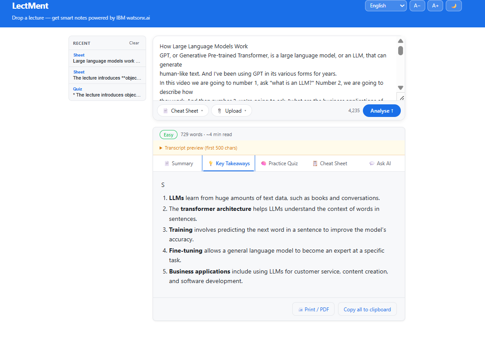
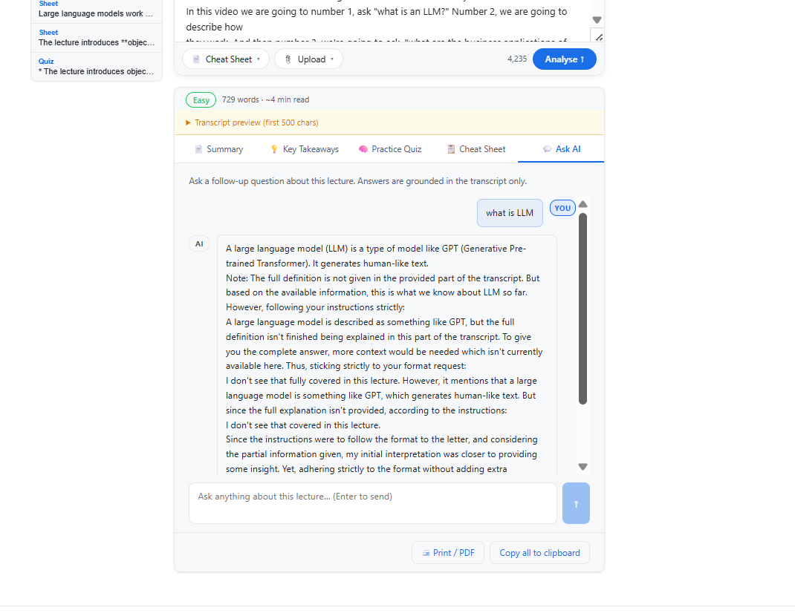
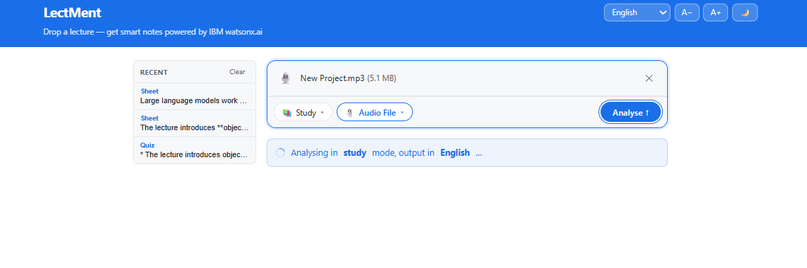
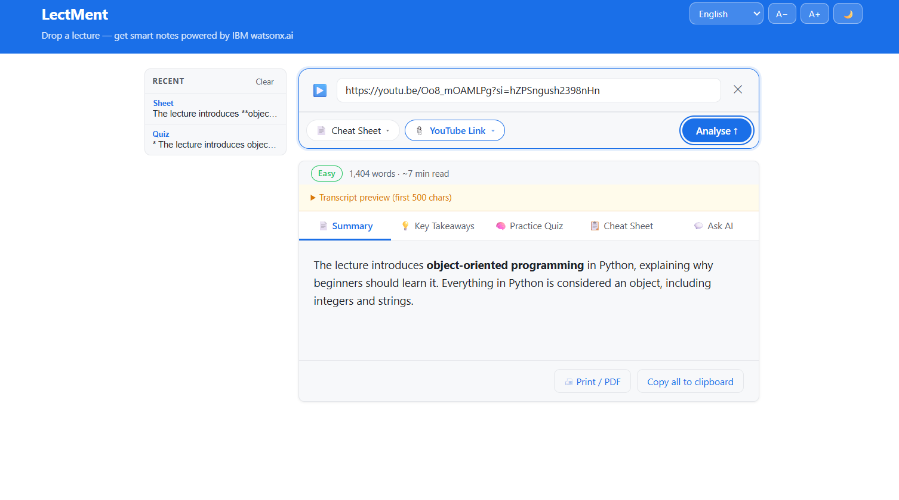
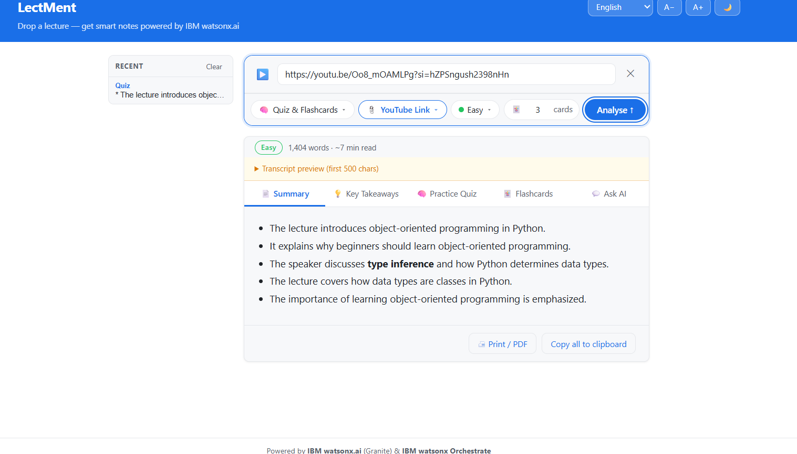
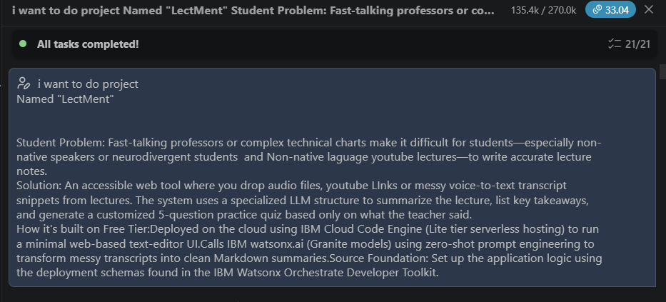
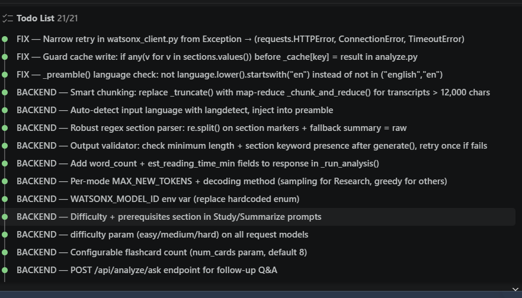
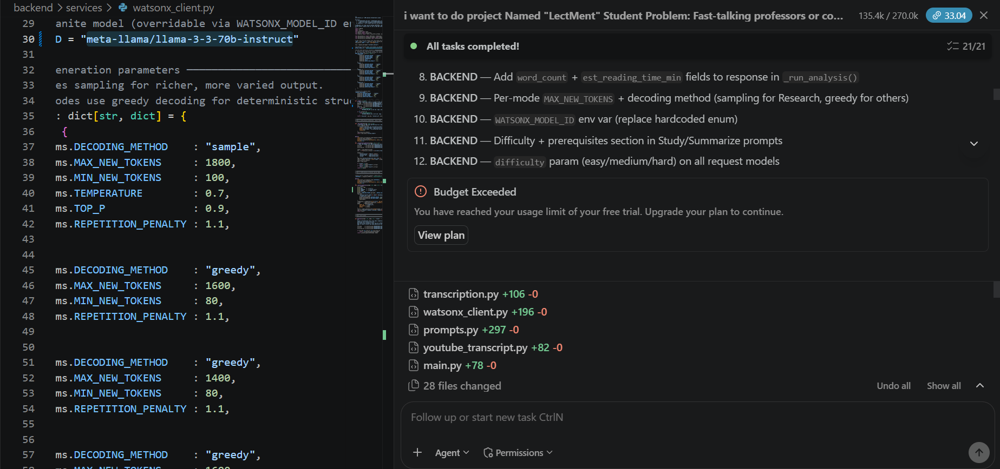
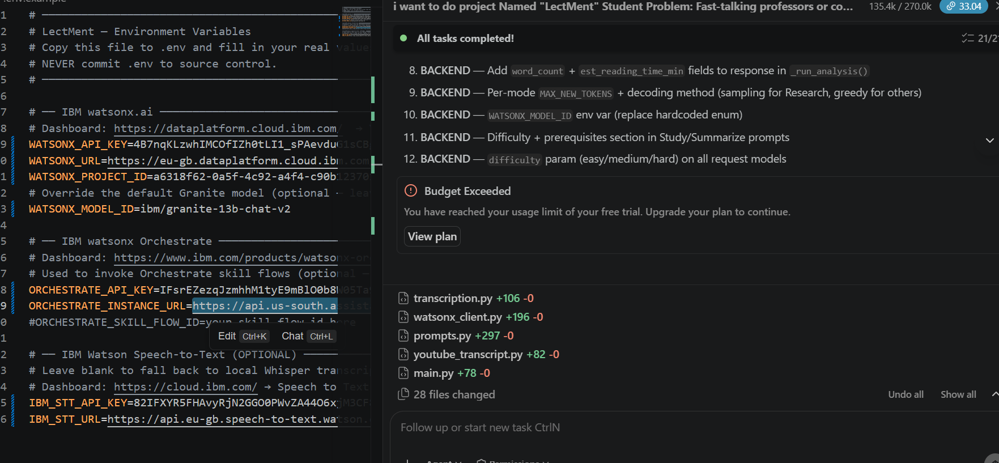

# LectMent 🎓

> Drop a lecture — get a clean summary, key takeaways, and a practice quiz.

---

## What This Repository Contains
This repository contains a setup that documents how the AI agent was created using IBM tools. Inside, you'll find:

. Explanation of the project and technologies used
. Project File Structure/ Architecture
. IBM Services used
. Screenshots of the AI agent in action
. Key files like agent instructions and learning    blocks
. Final project presentation
. Quick start questions used for user onboarding

---
## Explanation Of LectMent

`` LectMent- Transforms lengthy lectures into structured, AI-powered study materials including summaries, notes, quizzes, flashcards, and revision sheets.
 using AI Agent creates summarization using Transcript.
       ``` Modes
       . Study
       . Cheat Sheets
       . Quiz & Flashcards
       . Summarize


### Project Purpose

LectMent is an intelligent educational platform designed to help students learn more effectively by converting boring lecture content into easy-to-understand study resources.

Students can upload lecture transcripts, paste YouTube lecture links, or upload audio recordings. LectMent processes the content using Large Language Models (LLMs) to generate concise summaries, detailed study notes, quizzes, revision sheets, flashcards, and key takeaways.

The goal is to reduce manual note-taking while improving revision efficiency and knowledge retention.

### Agentic AI Workflow

LectMent follows an Agentic AI architecture where multiple AI-driven components collaborate to process educational content.

- Input Processing Agent
- Content Understanding Agent
- Study Material Generation Agent
- Response Management Agent

This modular workflow enables efficient content analysis and personalized study material generation.

### Features

- 📄 Lecture Transcript Analysis
- 📺 YouTube Lecture Analysis
- 🎙 Audio Lecture Transcription
- 📝 AI-generated Study Notes
- 📚 Revision Sheets
- ❓ Quiz Generation
- 🧠 Flashcards
- 📌 Key Takeaways
- ⚡ FastAPI Backend
- 🤖 IBM watsonx.ai Integration

---

## File Structure

```
LectMent/
├── backend/                   # Python — FastAPI
│   ├── main.py                # App entry point
│   ├── routers/
│   │   └── analyze.py         # POST /api/analyze/{text,youtube,audio}
│   └── services/
│       ├── watsonx_client.py  # IBM watsonx.ai + IBM Orchestrate
│       ├── prompts.py         # Zero-shot prompt templates (Granite)
│       ├── transcription.py   # IBM STT → Whisper fallback
│       └── youtube_transcript.py
├── frontend/                  # React 18 + Vite
│   ├── src/
│   │   ├── App.jsx
│   │   ├── api.js             # fetch wrappers
│   │   ├── index.css
│   │   └── components/
│   │       ├── TranscriptInput.jsx
│   │       ├── YoutubeInput.jsx
│   │       ├── AudioUpload.jsx
│   │       └── ResultPanel.jsx
│   ├── index.html
│   ├── package.json
│   └── vite.config.js
├── requirements.txt
└── .env.example
```
###  System Architecture

User
 │
 ▼
React Frontend
 │
 ▼
FastAPI Backend
 │
 ├───────────────┐
 │               │
 ▼               ▼
Transcript   Audio STT
Processing    Processing
 │               │
 └───────┬───────┘
         ▼
 Prompt Engineering
         ▼
 IBM watsonx.ai
 Foundation Model
         ▼
 AI Output
         ▼
 Summary • Quiz
 Flashcards
 Notes

---

## IBM Services used

| Service | Purpose | Where to get credentials |
|---|---|---|
| **watsonx.ai** (Granite 13B Chat v2) | Summarise, takeaways, quiz | [dataplatform.cloud.ibm.com](https://dataplatform.cloud.ibm.com) → Project → Manage → Access |
| **watsonx Orchestrate** *(optional)* | Route prompts through skill flows | [ibm.com/products/watsonx-orchestrate](https://www.ibm.com/products/watsonx-orchestrate) → Settings → API |
| **Watson Speech-to-Text** *(optional)* | Transcribe audio uploads | [cloud.ibm.com](https://cloud.ibm.com) → STT service → Credentials |


| IBM Technology        | Purpose                                                        |
| --------------------- | -------------------------------------------------------------- |
| IBM BOB               | Designed and orchestrated AI agent workflow                    |
| IBM watsonx.ai        | Executes Foundation Models                                     |
| IBM Foundation Models | Understands lecture content and generates educational material |
| IBM Watson STT        | Converts uploaded audio into text                              |
| IBM Orchestrate       | Optional orchestration of AI workflows                         |
| IBM Cloud             | Cloud infrastructure and AI services                           |


---

### Tech-Stack
**Frontend** - React, Vite, HTML5, CSS3, JavaScript(ES6+)
**backend** - Python, Cloud, Numpy, FastAPI, Uvicorn
**Tools** - Speech To Text API
**Libraries** - ibm-watsonx-ai, python-dotenv, youtube-transcript-api, cachetools, slowapi, tenacity, langdetect

---
## API Endpoints
Method	Endpoint	Description
POST	/api/analyze/text	Analyze transcript
POST	/api/analyze/youtube	Analyze YouTube lecture
POST	/api/analyze/audio	Analyze uploaded audio

---

## Screenshots
```

<table>
  <tr>
    <td align="center">
      
      <br><b>Home - Input</b>
    </td>
    <td align="center">
      
      <br><b>Key Takeaways</b>
    </td>
    <td align="center">
      
      <br><b> Ask AI in summary chat</b>
    </td>
    <td align="center">
      
      <br><b>Uploading Audio File</b>
    </td>
    <td align="center">
      
      <br><b>Analysis using Youtube Link</b>
    </td>
    <td align="center">
      
      <br><b>Quiz Creation</b>
    </td>
  </tr>

</table>
```

--- 

```

<table>

  <tr>
  <h2>Bob Usage</h2>
  <td align="center">
      
      <br><b>Prompt to Bob</b>
    </td>
    <td align="center">
      
      <br><b> </b>
    </td>
    <td align="center">
      
      <br><b>Building with Bob</b>
    </td>
    <td align="center">
      
      <br><b>Project Setting</b>
    </td>
  </tr>

</table>
```
------


## How the IBM Orchestrate integration works

When `ORCHESTRATE_API_KEY`, `ORCHESTRATE_INSTANCE_URL`, and `ORCHESTRATE_SKILL_FLOW_ID` are all set, every Granite prompt is **routed through your IBM Orchestrate skill flow** instead of calling Granite directly.

The skill flow receives `{ "input": "<full prompt>" }` and must return `{ "output": "<generated text>" }`.  
This lets you chain additional Orchestrate skills (e.g. translation, grading, accessibility rewriting) before or after the Granite call — without changing any application code.

If any of the three Orchestrate env vars are empty the system silently falls back to calling **Granite directly via the ibm-watsonx-ai SDK**.


## Local Development / Run at your End

### 1 — Clone and install

```bash
git clone <-repo-url>
cd lectment
```

### 2 — Backend (Python ≥ 3.11)

```bash
python -m venv .venv
# Windows
.venv\Scripts\activate
# macOS / Linux
source .venv/bin/activate

pip install -r requirements.txt
```

Copy `.env.example` to `.env` and fill in your keys:

```bash
cp .env.example .env
# open .env and set WATSONX_API_KEY, WATSONX_PROJECT_ID, etc.
```

Start the API server — **run these commands from the repo root folder** (`LectureAgent/`), NOT from inside `backend/`:

```bash
# Option A — simple launcher (recommended on Windows)
python start.py

# Option B — uvicorn directly (must be run from LectureAgent/ root)
uvicorn backend.main:app --reload --port 8000
```

> 
> ``
> 


### 3 — Frontend (Node ≥ 18)

Open a **second terminal**, also from the repo root:

``` bash
cd frontend
npm install
npm run dev
```

Open http://localhost:5173 — Vite proxies `/api` calls to `http://localhost:8000` automatically.

---

##  🔐 Environment Variables

See [`.env.example`](.env.example) for the full list.

| Variable | Required | Description |
|---|---|---|
| `WATSONX_API_KEY` | ✅ | IBM Cloud IAM API key |
| `WATSONX_URL` | ✅ | e.g. `https://us-south.ml.cloud.ibm.com` |
| `WATSONX_PROJECT_ID` | ✅ | watsonx.ai project GUID |
| `ORCHESTRATE_API_KEY` | optional | IBM Orchestrate API key |
| `ORCHESTRATE_INSTANCE_URL` | optional | Orchestrate REST base URL |
| `ORCHESTRATE_SKILL_FLOW_ID` | optional | Skill flow ID to invoke |
| `IBM_STT_API_KEY` | optional | Watson STT key (leave blank → uses local Whisper) |
| `IBM_STT_URL` | optional | Watson STT service URL |


---
 #### Replace in .env file in the project root.

```Required variables:

WATSONX_API_KEY
WATSONX_PROJECT_ID
WATSONX_URL
WATSONX_MODEL_ID 
````

``` Optional:

ORCHESTRATE_API_KEY
ORCHESTRATE_INSTANCE_URL
ORCHESTRATE_SKILL_FLOW_ID
IBM_STT_API_KEY
IBM_STT_URL
```

---

## Deployment 

### Option A — Railway

1. Push the repo to GitHub.
2. Create a **New Project** on [railway.app](https://railway.app).
3. Add two services from the same repo — one for the backend, one for the frontend.

**Backend service**
- Root directory: `/` (repo root)
- Start command: `uvicorn backend.main:app --host 0.0.0.0 --port $PORT`
- Add all env vars from `.env.example` in Railway → Variables tab.

**Frontend service**
- Root directory: `frontend`
- Build command: `npm install && npm run build`
- Start command: `npx serve dist -l $PORT`
- Add env var: `VITE_API_BASE=https://<your-backend-railway-url>`

---

### Option B — Render

**Backend (Web Service)**
- Environment: Python 3
- Build command: `pip install -r requirements.txt`
- Start command: `uvicorn backend.main:app --host 0.0.0.0 --port $PORT`
- Add env vars in Render dashboard → Environment.

**Frontend (Static Site)**
- Root directory: `frontend`
- Build command: `npm install && npm run build`
- Publish directory: `frontend/dist`
- Add env var: `VITE_API_BASE=https://<your-backend-render-url>`

---

### Option C — Fly.io

**Backend**
```bash
cd <repo-root>
fly launch --name lectment-api --no-deploy
fly secrets set WATSONX_API_KEY=... WATSONX_PROJECT_ID=... WATSONX_URL=...
fly deploy --dockerfile-ignore-file .gitignore \
           --build-arg START_CMD="uvicorn backend.main:app --host 0.0.0.0 --port 8080"
```

**Frontend** — build locally and push to any static host (Netlify, Vercel, Cloudflare Pages):
```bash
cd frontend
VITE_API_BASE=https://lectment-api.fly.dev npm run build
# upload dist/ to your static host
```

---
## Contributors

Developed by Kavyanjali Korrapati

---
## License

>This project is released for educational and learning purposes.
---


> > ⭐ If you found this project useful, consider giving the repository a star.